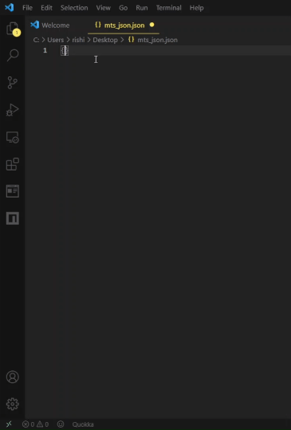
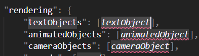
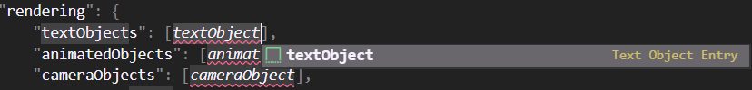

# JSON Snippets for MTS Pack Development

A collection of small snippets that will help you speed up writing MTS JSONs

## Features

### Section Snippets and Entry Snippets:

Type the name of the section or field, or press `Ctrl`+`Space` to bring up Intellisense/auto-complete.

For example if you want the `general` section:

> Tip: Press `Tab` to move to the next field or `Shift`+`Tab` to go to the previous. You can also press `Tab` to choose an option in a choice field.

Sometimes you might get an object (animatedObejct, textObject, etc.) inside a field. In that case, use `Ctrl`+`Space` to activate Intellisense and auto-complete the object in it's place.

When you reach that field, press `Ctrl`+`Space` to bring up the Intellisense.

:slightly_smiling_face: Enjoy!

## Known Issues

> None

## Release Notes

### 1.0.0

> Initial release of MTS JSON Snippets.

### 1.0.1

> Fixed spelling errors.
